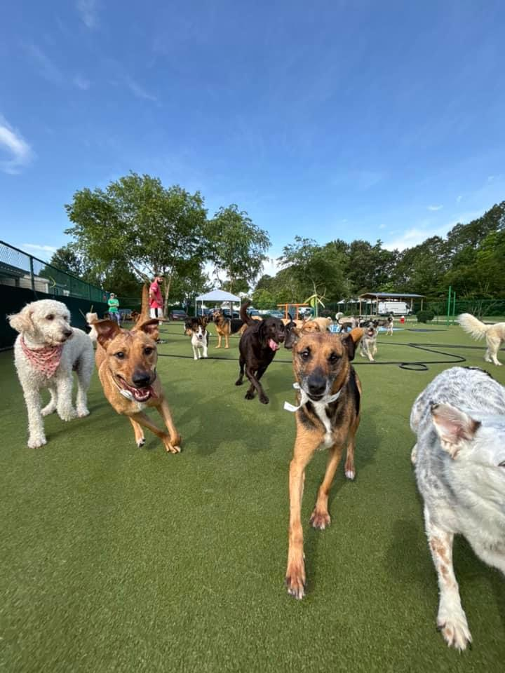

# Homework 1: Tool Setup

Amelia Ragsdale  
CS 625, Fall 2025  
Due: September 7, 2025

## Git, GitHub

### Q1 - URL of GitHub Repo

My URL for my GitHub Repo is https://github.com/amelia1209812/CS625_FALL25 . I used this repo to practice basic Git operations like adding files, committing, pushing, and pulling the different changes.

### Q2 - Pull Command

"git pull" send remote changes to the local machine. The "pull" command fetches updates from the remote repository and then merges them into the current local branch. It does not send changes to the server, that is what "git push" does.

### Q3 - Local Commits

I would have might forgotten to run "git push." When committing a change with "git commit," it only saves the update locally. To transfer the change to the GitHub repository, I will need to run "git push" so that it will show up on the GitHub desktop. 

## Markdown

### Q1 - Bulleted List

- Apples
- Bananas
- Grapes

A bulleted list is unordered which means the items do not have a specific sequence. A numbered list is ordered and further implies that the order or ranking of items is important such as steps in a process.

### Q2 - Markdown Paragraph

I was walking through the *interfimensional potato farm* when I stumbled upon a **talking llama** who whispered, "***Never trust a penguin with sunglasses***." Confused, I typed `llama.speak("Hello, traveler!")` into my reality debugger and suddenly a portal opened. If this sounds absurd, you're not alone; real more about these phenomena at the [Society for the Bizarre Agricultural Incidents](https://www.youtube.com/watch?v=dQw4w9WgXcQ).

### Q3 - Animal Image

 This image of my dog was uploaded to the same directory as my report file and is displayed using the MArkdown image syntax.

## Tableau

### Q1 - Region Other Than the South

Insert your answer and explanation here

## Google Colab

### Q1 - URL of Google Colab Notebook

Insert your answer and explanation here

## Python/Seaborn

### Q1 - First Penguin Image

Insert your answer and explanation here

### Q2 - Second Penguin Image

Insert your answer and explanation here

### Q3 - Outer Parenthesis

Insert your answer and explanation here

## Observable and Vega-Lite

### Q1 - markCircle to markSquare

Insert your answer and explanation here

### Q2 - markCircle to markPoint

Insert your answer and explanation here

### Q3 - Swap X and Y Axes on Scatterplot

Insert your answer and explanation here

### Q4 - Remove fieldN(Origin)

Insert your answer and explanation here

## References

*Eavery report must include a References section that lists the webpages and URLs that you consulted while completing the assignment. Replace the items below with the references you consulted - these are just examples.* ***Everyone will use some reference to complete these assignments (even I would). You will lose points on your assignment if you do not include the references you used.***

* Graph Network using Vega-Lite or Vega, <https://stackoverflow.com/questions/77096216/graph-network-using-vega-lite-or-vega>
* Calculating percentage change - Math for journalists, <https://observablehq.com/@nshiab/math-for-journalists>
* ChatGPT: "How can I add an axis label to my line chart in Seaborn?", <https://chatgpt.com/share/684c8e25-4944-8011-b265-ae9aefc07959>
