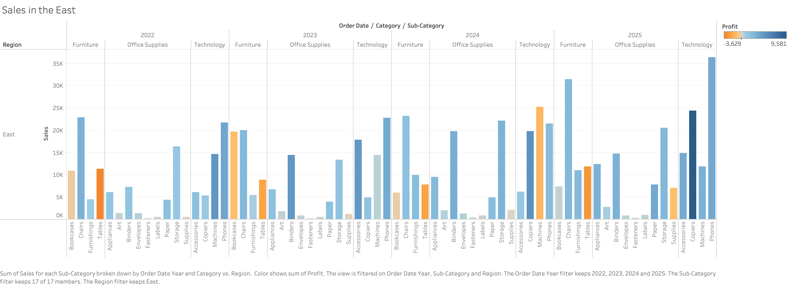
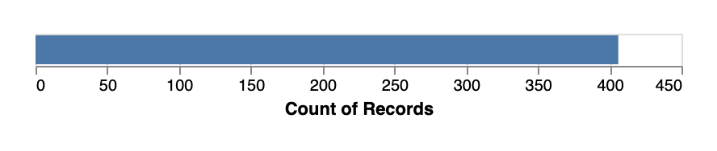

# Homework 1: Tool Setup

Amelia Ragsdale  
CS 625, Fall 2025  
Due: September 7, 2025

## Git, GitHub

### Q1 - URL of GitHub Repo

My URL for my GitHub Repo is https://github.com/amelia1209812/CS625_FALL25 . I used this repo to practice basic Git operations like adding files, committing, pushing, and pulling the different changes.

### Q2 - Pull Command

"git pull" send remote changes to the local machine. The "pull" command fetches updates from the remote repository and then merges them into the current local branch. It does not send changes to the server, that is what "git push" does.

### Q3 - Local Commits

I would have might forgotten to run "git push." When committing a change with "git commit," it only saves the update locally. To transfer the change to the GitHub repository, I will need to run "git push" so that it will show up on the GitHub desktop. 

## Markdown

### Q1 - Bulleted List

- Apples
- Bananas
- Grapes

A bulleted list is unordered which means the items do not have a specific sequence. A numbered list is ordered and further implies that the order or ranking of items is important such as steps in a process.

### Q2 - Markdown Paragraph

I was walking through the *interfimensional potato farm* when I stumbled upon a **talking llama** who whispered, "***Never trust a penguin with sunglasses***." Confused, I typed `llama.speak("Hello, traveler!")` into my reality debugger and suddenly a portal opened. If this sounds absurd, you're not alone; real more about these phenomena at the [Society for the Bizarre Agricultural Incidents](https://www.youtube.com/watch?v=dQw4w9WgXcQ).

### Q3 - Animal Image

 This image of my dog was uploaded to the same directory as my report file and is displayed using the MArkdown image syntax.

## Tableau

### Q1 - Region Other Than the South

 This bar chart shows the total sales by product sub-categoryfor the East region, using the Sample-Superstore dataset provided by Tableau. I filtered the data set to show only order from the East and then sorted the sub-categories by total sales in descending order. This chart helps show which product types contribute the most revenue in that specific region.

## Google Colab

### Q1 - URL of Google Colab Notebook

[Click here to view my edited Google Colab notebook.](https://colab.research.google.com/drive/1DPzKkwnf7ublCETg9x0oy47Hue2RZ1Ia?usp=sharing) I followed the overview tutorial, ran example code, and made my own edits to several of the cells. I also added text cells below each of the edited cells to explain what exactly I changed.

## Python/Seaborn

### Q1 - First Penguin Image

 
This scatter plot visually shows the relationship between bill length and bill depth across all penguins in the dataset. Each dot represents a penguin. The plot helps identify patterns or grouping based on the beak size, which is useful for distinguishing the different species.

### Q2 - Second Penguin Image

This bar chart shows the average body mass in grams for each penguin species. It aggregates the data using `.Agg()`, allowing for easy comparison of how heavy each species of penguins tend to be.

### Q3 - Outer Parenthesis

When removing the outer parentheses I got a syntax error this is because Python expects `.add()` to be called on the result of the `so.Plot()` expression. The outer parentheses allows the statment to be broken into multiple lines. Without having the parentheses, Python does not know where the full statement begins and ends.

## Observable and Vega-Lite

### Q1 - markCircle to markSquare

When I changed `markCircle()` to `markSquare()`, each data point within the scatterplot changed from a circle to a square. This did not change the data itself but only the shape of the markers.

### Q2 - markCircle to markPoint

When I changed to `markPoint()`, the points became smaller with slight styling differences. `markPoint()` is a marker that can be further customized, and by default, looks like outline circles compared to filled-in circles or squares.

### Q3 - Swap X and Y Axes on Scatterplot

To swap the x and y axes, I changed the field assignments to reflect this:
`vl.x().fieldQ("Miles_per_Gallon")`
`vl.y().fielQ("Horsepower")`
This reverses which variable is plotted on which axis, allowing you to look at the same data from a different view/orientation.

### Q4 - Remove fieldN(Origin)

When I commented out the `vl.y().fieldN("Origin")` line, the chart could no longer grou the data by origin. Instead, the bars were compressed to a single category, causing the chart to display just one bar per value on the x-axis. This happened because the vertical (y-axis) was removed.

## References

* Graph Network using Vega-Lite or Vega, <https://stackoverflow.com/questions/77096216/graph-network-using-vega-lite-or-vega>
* Adding a File to a Repository,
<https://docs.github.com/en/repositories/working-with-files/managing-files/adding-a-file-to-a-repository>
* Tutorial: Get Started with Tableau Desktop, <https://help.tableau.com/current/guides/get-started-tutorial/en-us/get-started-tutorial-home.htm>
* Step 3: Focus your results,
<https://help.tableau.com/current/guides/get-started-tutorial/en-us/get-started-tutorial-focus.htm>
* Palmer Penguins Dataset,
<https://github.com/mcnakhaee/palmerpenguins>

