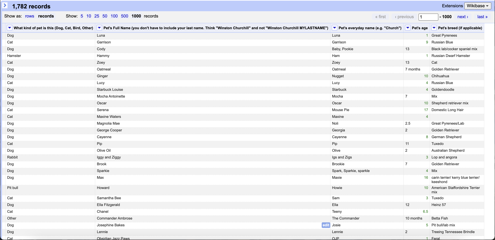
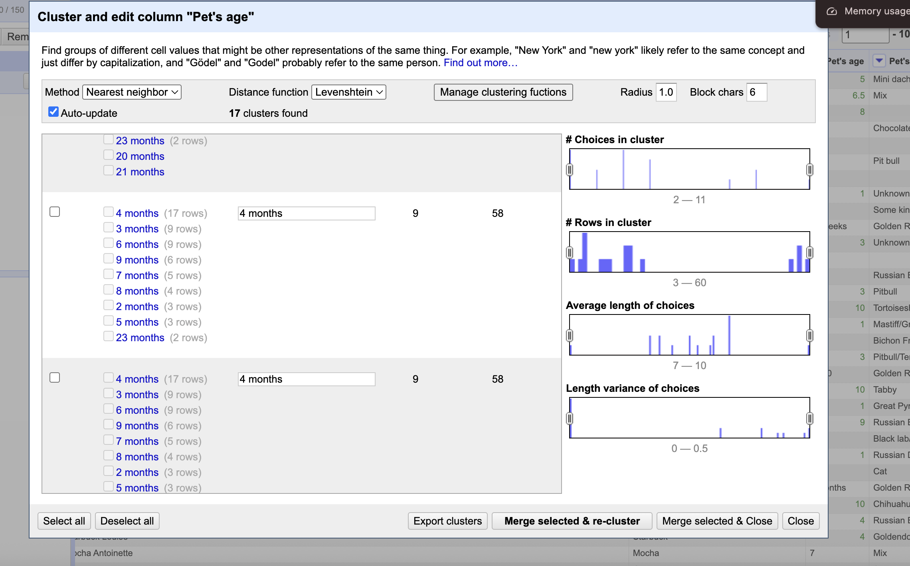
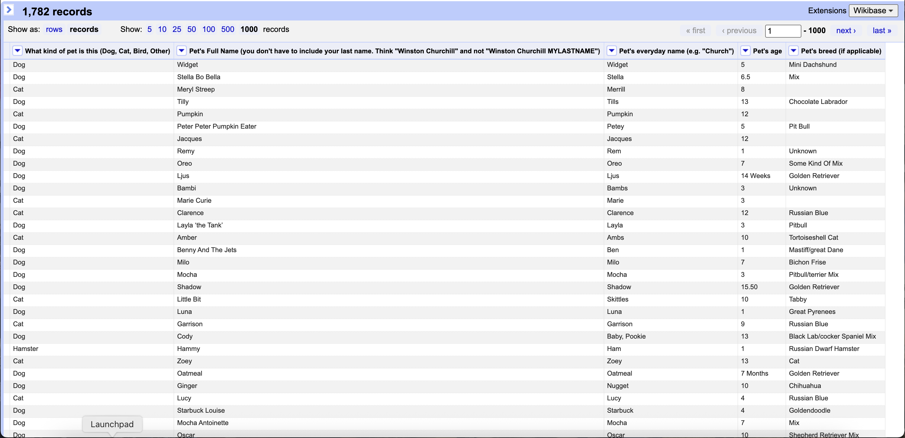

# Homework 2: Data Cleaning

Amelia Ragsdale  
CS 625, Fall 2025  
Due: September 21, 2025

## Part 1. Data Cleaning

### Explanation

For this assignment, I used OpenRefine to clean the PetNames dataset in preparation for analysis in Part 2. I focused on key colums such as the kind of pet, pet name, pet full name, age, and breed, all of which contained significant inconsistencies and irrelevant data. My goal was not to perfectly clean the entire dataset, but to clean enough by using GREL, clustering, facets, and manual edits to ensure meaningful and accurate analysis could be performed after the cleaning.

For the "**kind of pet**" column, the data was very inconsistent. There were many varioated in capitalization (like "Dog", "dog", "DOG") as well as completely unrelated entried (like cardboard cut out). I started by applying a **Text Facet** to quickly see all unique values and used **clustering** to further merge varioations of common animal types. However, due to the amount of unusual entries and misspellings that it couldn't be resolved through clustering, I also had to do significiant amount of manual cleaning in this columns. This included filtering out irrelevant rows and standardizing terms to a consistent format (ex. "puppy" to "Dog").

For the **pet name** column, I used a similar approach. I began with a **Text Facet** and used **clustering** to identify and merge variations of the same name, such as "bella", "Bella", and "BELLA". I also applied **GREL transformations** to standardize capitalization account all names using expressions like `value.toTitlecase()` and `value.trim()` to clean up any whitespace and casing issues. I also used the expression `value.replace("'","")` to remove unwanted characters that were leftover in the different pet names. Some names had multiple entries or special characters that clustering didn't resolve well, so I made targeted **manual edits** to fix those as well.

In the **pet full name** column, I followed the same process: clustering to merge similar entries, and GREL to handle formatting. I used expressions like `values.toTitlecase()` to fix the inconsistent capitalization, and `if(isBlank(value), "Unknown", value)` to fil in missing or blank entries withha default value of "Unknown". This helped reduce noise and made the column more consistent for analysis.

 

The **age** column was by far the most difficult and time-consuming to clean. It included a wide variety of inconsistent and irrelevant enteries such as "puppy", "baby", "born in 2015", and specific ages like "10 months", "2 years", and "~5". I started by filtering the colums by used facets to identify valid age entries and listed rows as "Unknown" if it couldn't be used for numeric analysis. I chose to keep only those enteries that specified age in either weeks, months, or year. 

I attempted to normalize the age values using **GREL expressions** to convert months to decimal years (ex. 6 months = 0.5 ) and to extract numbers from strings. One expression I used was:

`if(value.toLowercase().contains("month"),
  toNumber(value.toLowercase().split(" ")[0]) / 12,
  if(value.toLowercase().contains("year"),
    toNumber(value.toLowercase().split(" ")[0]),
    null
  )
)
`
However, while testing several variations of the above **GREL expression**, I accidentally applied a expression that wiped out the entire column, deleting all the age values. Fortunately, I was able to recover my work by using OpenRefine's **Undo/Redo history**, which allowed me to revert the changes and start over. After recovering the data, I attempted to complete additional cleaning using both **clustering** and **manual edits**. In the end, I retained only cleaned enteries where the age was clearly expressed in weeks, months, or number of year.

In conclusion, across all columns I made extensive use of **GREL transformations**, including `value.toTitlecase()` for capitalization, `value.trim()` to remove extra spaces, `value.replace(" and ", ",")` to separate multi-pet names, and `f(isBlank(value), "Unknown", value)` to fill in missing data. I avoided using RegEx heavily after some earlier expressions caused errors or unexpected deletions. For columns that did not require numeric conversion, I focused on consistency, formatting, and removing unwanted characters. While I relied heavily on OpenRefine’s powerful features like facets, clustering, and transformations, I also made targeted manual edits when automated methods weren’t effective. In particular, the “kind of pet” and “age” columns required the most manual attention due to the wide variety of inconsistent, messy, or irrelevant entries.

## Part 2. Analyze Cleaned Data

### Q1 - How many kinds of pets are in your cleaned dataset?

I used a **Text Facet** on the "Kind of Pet" column to see all the unique types of animal in the dataset. After cleaning (removing, irrelevant or fake enteries like "server" or "card"), i found 46 kinds of pets in the cleaned data. these included common pets such as dog, cat, guinea pig, rabbit, bird, fish, etc. One odd pet to note is a cow.

### Q2 - How many breeds of cats are in your cleaned dataset?

I filtered the dataset to only include enteries where the kind of pet is "Cat". Then I applied a **Text Facet** on the **Breed** column. After reviewing and attempting to merge all similar breed names through clustering and during cleaning, I found 97 cat breeds in the dataset.

### Q3 - How many guinea pigs are in your cleaned dataset?

I filtered the "Kind of Pet" column to include only rows labeled "Guinea Pig". The cleaned dataset contains 10 guinea pigs. I ensured that the cleanig phase, all variations like "guinea pig", "guineapig", "piggy", etc. were all clustered together under a single standardized term.

### Q4 - Who is the oldest dog in your cleaned dataset? Give the dog's name, breed, and age. If there's a tie, list all oldest dogs.

I filtered the dataset to include only dogs and then sorted the "Age" column in descending order. There were two dogs of the same oldest age:

**Name**: Elsa
**Breed**: German Shepherd
**Age**: 23

**Name**: Belle
**Breed**: Golden Retriever
**Age**: 23

### Q5 - What is the most popular everyday name for a dog in your cleaned dataset? If there's a tie, list all top names and number of occurrences.

After filtering the dataset to include only dogs, I applied a **Text Facet** on the **Name** column. I sorted the facet by count and found that the most popular dog name is:

**Name**: Sophie
**Count**: 9 occurrences

### NOTE

These results are based on my cleaned dataset. Some answers, especially for breed counts and pet types, depend on how I handled inconsistent or irrelevant entried. This may result in slightly different counts or rankings compared to another's cleaned dataset.
