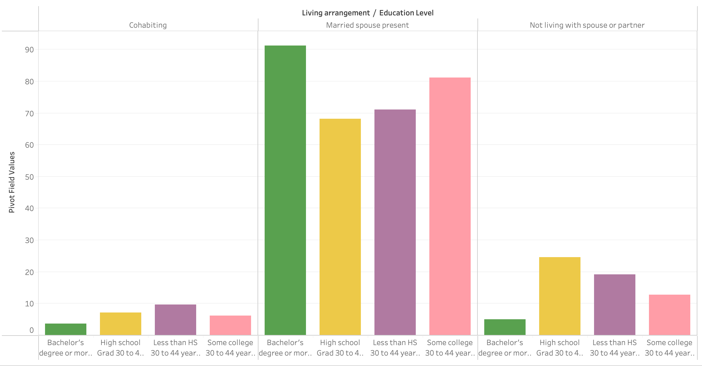
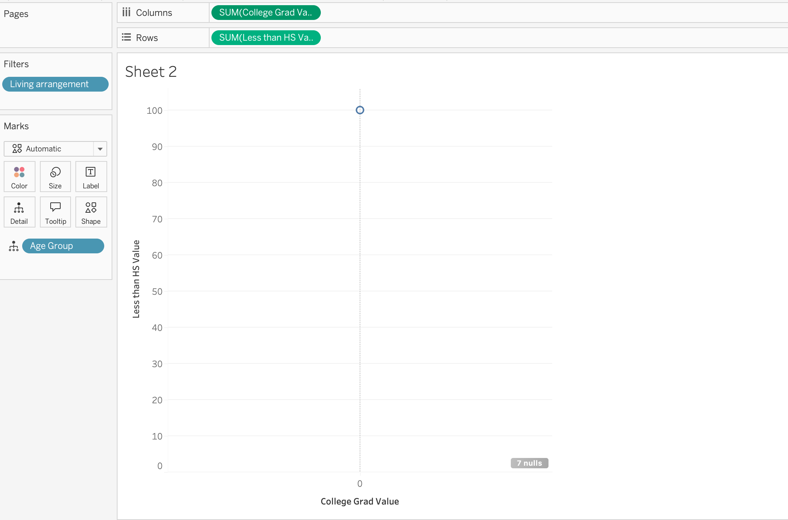
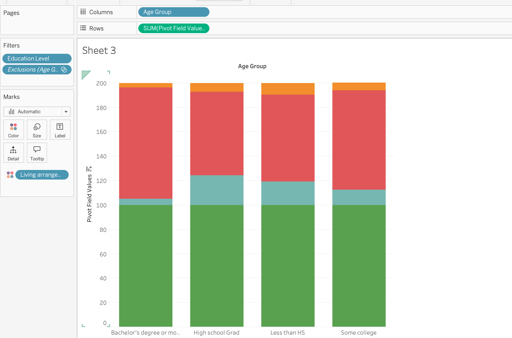

# Homework 3: Create Vis Idioms from Real-World Data

Amelia Ragsdale  
CS 625, Fall 2025  
Due: September 28, 2025

## Data

I used Table 90 from Section 2. Birth, Deaths, Marriages, and Divorces of the 2012 Statistical Abstract of the United States. his dataset reports the number of women who gave birth within the past year, categorized by their living arrangements (such as married, unmarried, or other household types), different age groups, and levels of educational attainment.

For my analysis, I cleaned the dataset by attempting to remove totals, percentage and aggregated categories, and reformatted the data into a tidy structure suitable for visualization. I focused on a subset of age ranges and education levels to highlight meaningful comparisons while keeping the charts clear and interpretable.

## Chart 1 - Bar Chart

***Idiom***: Bar Chart
***Marks***: Rectangles (Bars)
***Data***: Educational Attainment (categorical), Number of Women (quantitative)
***Encode***: Living Arrangment/Education Level -> x-axis, Pivot Field Values -> y-axis

A bar chart is effective because educational attainment is a categorical variable with distinct, non-numeric groups (e.g., less than high school, high school graduate, some college, bachelor’s degree or more). Bar charts make it easy to compare the relative number of women across these categories. The differences in bar heights and color give an immediate, visual sense of which education levels are associated with higher or lower numbers of births in the past year. Since the values represent counts, not continuous measures, the discrete nature of a bar chart is more interpretable than, say, a line chart.

[

## Chart 2 - Scatterplot

***Idiom***: Scatterplot
***Marks***: Points (circles)
***Data***: Age group (categorical/ordinal), Number of women (quantitative), Living arrangement (categorical for color/shape)
***Encode***: College Grad Value -> x-axis, Less than HS Value -> y-axis, Living arrangement -> point color/shape

A scatterplot is appropriate here because age groups can be treated as ordinal categories that progress in order (15–29 and 30-44), and the number of women is a quantitative variable. Plotting these as points allows us to see how births are distributed across age groups. Adding living arrangement as a color or marker shape introduces a third variable, letting us see whether women who are married, unmarried, or in other living situations follow similar or different age-related patterns. Unlike a bar chart, which would only show totals, the scatterplot emphasizes the relationship between age and childbirth while keeping categories visually distinct.

##Chart 3 - Multiple Line Chart

***Idiom***: Multiple Line Chart
***Marks***: Lines
***Data***: Age Group (ordinal), Number of Women (quantitative), Educational Level (categorical)
***Encode***: Age group -> x-axis, Pivot Field Values -> y-axis, Living arrangement -> line color

A multiple line chart is useful because it shows trends across an ordered dimension (age) while also allowing direct comparison between groups (education levels). By connecting data points with lines, we can observe whether childbirth rates rise or fall consistently across age groups, and whether those trends differ depending on education.
**Please note, I tried multiple times to get the data in Tableau to show lines and it kept stacking the data into a color coded bar graph.**

## Recreated Chart

### NOTE & REFERENCES

I had extreme difficulty cleaning the data from the Census website which caused problems showing visualization in data specifically in the Scatterplot chart. I also faced many glitches in Tableau which made it difficult to have the visualization show the correct visual I was going for.

[HW2-petnames.csv](https://github.com/amelia1209812/CS625_FALL25/blob/main/HW2-petnames.csv)

[HW2-petnames.json](https://github.com/amelia1209812/CS625_FALL25/blob/main/HW2-petnames.json)
