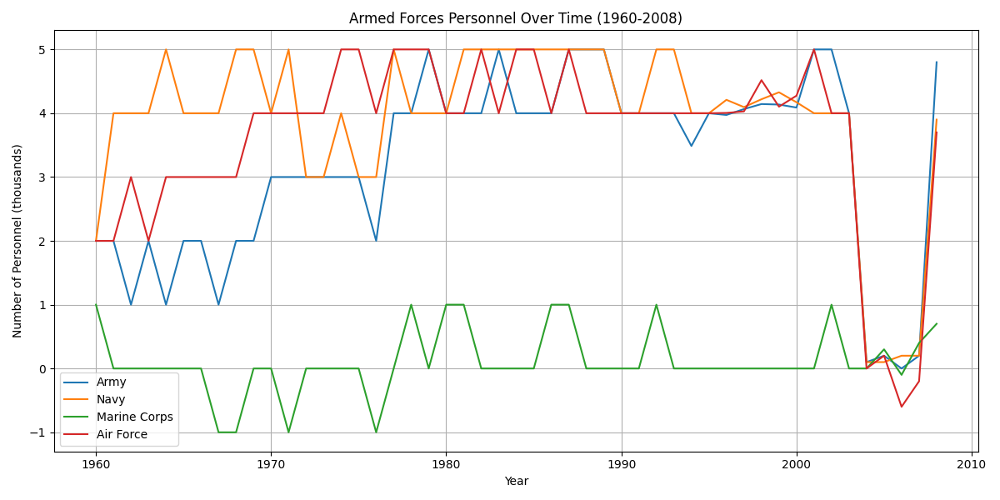
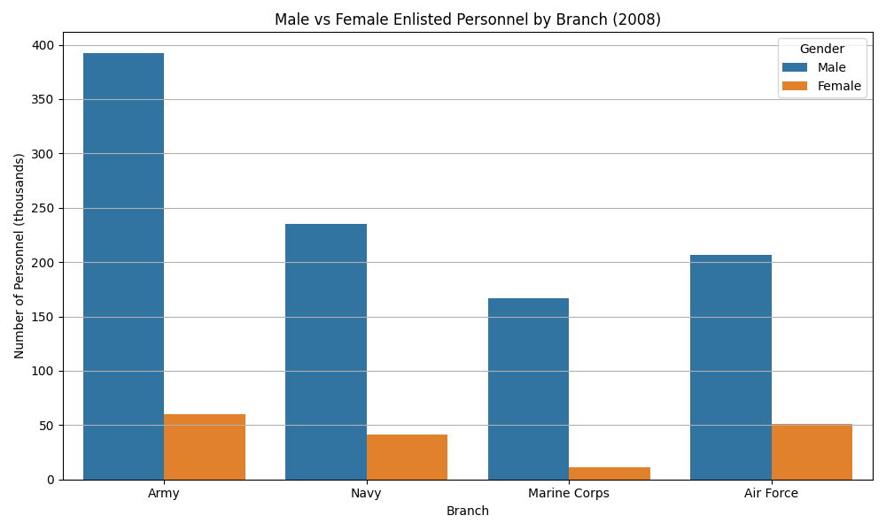

# HW4 - Arrange Tables
**Amelia Ragsdale**
**CS 625, Fall 2025**
**Date: October 12, 2025**

## Question 1: Total DoD Personnel by Branch (1960–2008)

**Line Chart:**

**Idiom-Mark-Data-Encode Table:**

| Element |	Details |
|---------|---------|
| Idiom	  | Line chart |
| Mark    |	Line + point markers |
| Data	  | Total personnel by branch, 1960–2008 |
| Encoding|	x → Year (position), y → Number of Personnel , color of line → Branch |

**Explanation:**

A line chart shows the trends over time for multiple branches. By using distinct colors and markers allows clear differentiation between the different military branches. Grid lines improve readability of year-by-year changes (1960-2008).

**Insights:**

The line chart shows that the Army and Navy have historically maintained the largest personnel numbers, reflecting their central roles in military operations. The Air Force, Army, and Navy experienced a peak in personnel followed by a gradual decline after the 2000s, likely corresponding to restructuring and changes in defense priorities. The Marine Corps, by contrast, shows relatively steady numbers over the same period, indicating a consistent but smaller force size. Overall, the chart provides a clear view of how personnel distribution among the branches has evolved over nearly five decades.

**Design Decisions / Customizations:**

The use of distinct colors and point markers for each branch allows the user to easily differentiate between the branches while following trends over time. The grid lines were added to make it easier for the user to read the data and support precise comparison across years. Additionally, the figure size was increased to ensure that all lines and markers are clearly visible, preventing clutter and making the visualization more accessible. I used Python to construct the bar chart and the further analyze the data.

**Link:**

- Excel Data File: [Defense.xlsx](github link)
- Python File: [HW4.py](github link)
  
## Question 2: Male vs Female Enlisted Personnel by Branch (2008)

**Chart:**

## Idiom-Mark-Data-Encode Table:

| Element |	Details |
|---------|---------|
| Idiom	  | Bar chart |
| Mark    |	Bar |
| Data	  | Male and femal personnel by branch in 2008 |
| Encoding|	x → Branch (position), y → Number of Personnel (thousands) , color → Gender |

**Explanation:**

The grouped bar chart allows for direct comparison of the male vs female personnel within each branch of military in 2008. The two colors of the bars show a clear differentiation of the genders and ordering the branches along the x-axis supports visual comparison across the branches.

**Insights:**

The grouped bar chart reveals that male personnel dominate all branches of the military in 2008, with the Air Force having the highest proportion of females at approximately 20%, followed by the Navy at 15%, the Army at 12%, and the Marine Corps at only 6%. This visualization highlights not only the gender imbalance within the armed forces but also the differences in female representation across branches, offering insight into potential areas for revised policy or recruitment focus.

**Design Decisions / Customizations:**

The grouped bars were chosen instead of stacked bars to make it easier to compare male and female counts within each of the military branches directly. The two colors were then used to clearly distinguish between genders, and a legend was included for clarity. The x-axis labels were adjusted to ensure readability for which branch it was displaying, and the chart layout was adjusted to provide sufficient spacing so that all branches and gender bars are easily distinguishable. I used Python to construct the grouped bar chart and the further analyze the data.

**Link:**

- Excel Data File: [Defense.xlsx](github link)
- Python File: [HW4.py](github link)

## Further Questions

When exploring this dataset it raises several additional questions that can be later further explored: 

- How female representation has changed over time across the different branches and whether specific recruitment policies or social changes influenced these trends?
  
- Has fluctuations in total personnel correlate with major military events, such as conflicts or changes in defense strategy?
  
-  When comparing total DoD personnel with overall U.S. population trends, could it provide insight into the proportion of citizens serving in the military and how this ratio has evolved over time?
  
## References

- Github, *Dataset Folder*, <https://github.com/odu-cs625-datavis/public-fall25-mcw/blob/main/datasets/10s0498.xls>
- Microsoft, *Python Support in Visual Studio on Windows*, <https://learn.microsoft.com/en-us/visualstudio/python/overview-of-python-tools-for-visual-studio?view=vs-2022>
- Openpyxl, *openpyxl - A Python library to read/write Excel 2010 xlsx/xlsm files*, <https://openpyxl.readthedocs.io/en/stable/>
- Github, *HW4: Arrange Tables*, <https://github.com/odu-cs625-datavis/public-fall25-mcw/blob/main/HW4-arrange.md>
