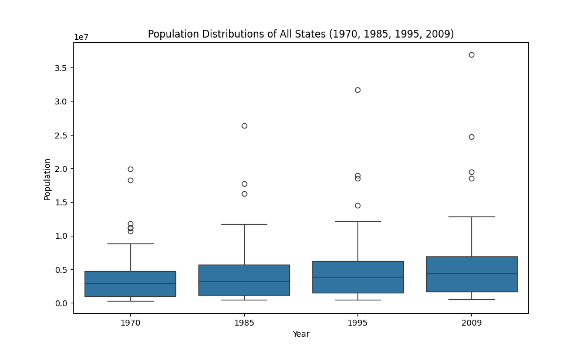
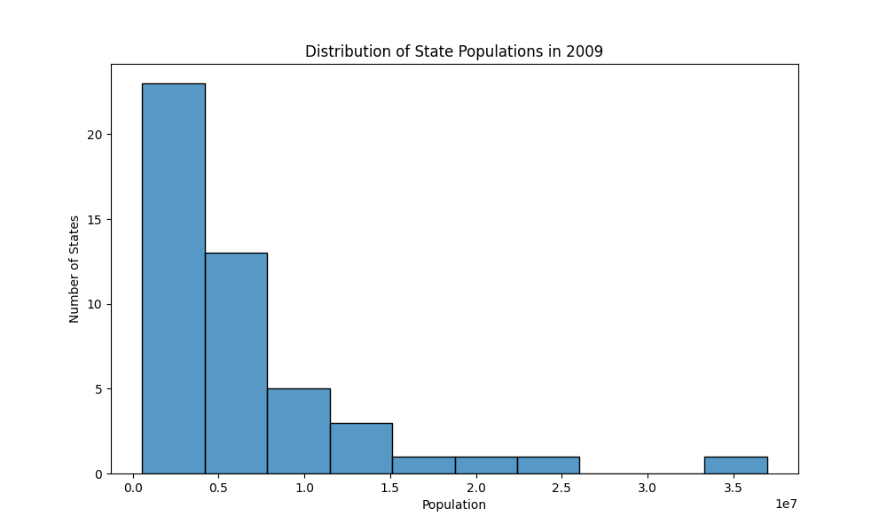
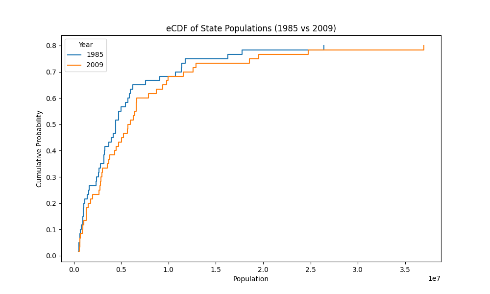
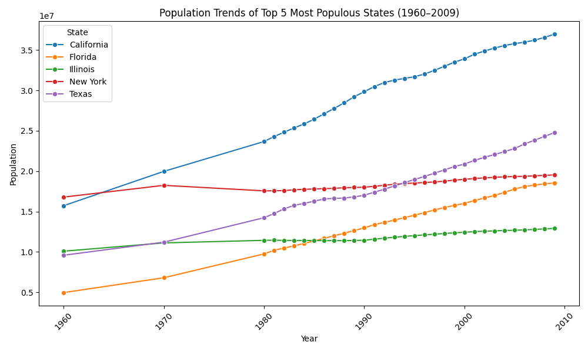
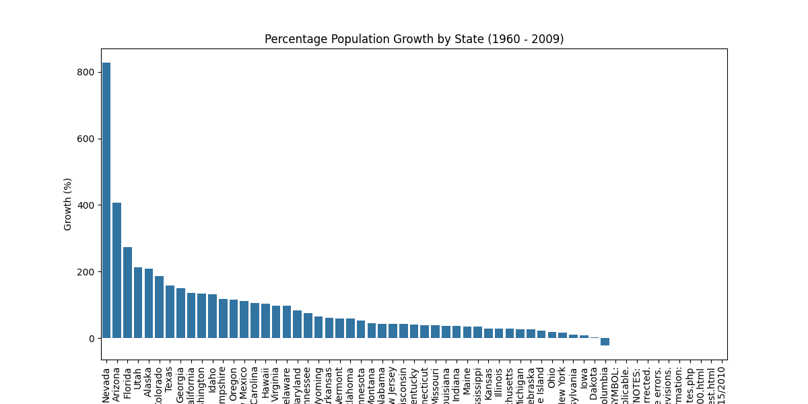
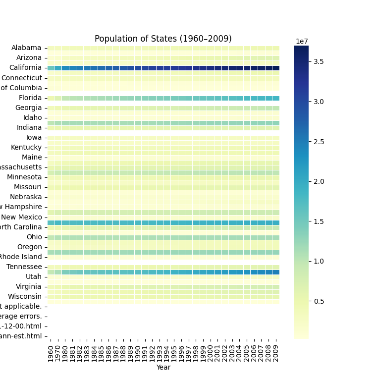

# HW5 - Analyzing Data Using Distribution Charts

Amelia Ragsdale

CS 625, Fall 2025

Date: November 2nd, 2025

## Part 1: Resident Population - States (1970 - 2009)

**Data Preparation and Manipulation**

**Boxplot - State Populations in 1970, 1985, 1995, and 2009**

**Explanation:**

A line chart shows the trends over time for multiple branches. By using distinct colors and markers allows clear differentiation between the different military branches. Grid lines improve readability of year-by-year changes (1960-2008).

**Advantages:**

The line chart shows that the Army and Navy have historically maintained the largest personnel numbers, reflecting their central roles in military operations. The Air Force, Army, and Navy experienced a peak in personnel followed by a gradual decline after the 2000s, likely corresponding to restructuring and changes in defense priorities. The Marine Corps, by contrast, shows relatively steady numbers over the same period, indicating a consistent but smaller force size. Overall, the chart provides a clear view of how personnel distribution among the branches has evolved over nearly five decades.

**Disadvantages**

The use of distinct colors and point markers for each branch allows the user to easily differentiate between the branches while following trends over time. The grid lines were added to make it easier for the user to read the data and support precise comparison across years. Additionally, the figure size was increased to ensure that all lines and markers are clearly visible, preventing clutter and making the visualization more accessible. I used Python to construct the bar chart and the further analyze the data.

**Observations**

- Excel Data File: [Defense.xlsx](github link)
- Python File: [HW4.py](github link)

**Histogram - Distribution of State Populations in 2009**

**Explanation:**

**Advantages:**

**Disadvantages:**

**Observations:**

**eCDF - State Population Distributions (1970 vs. 2009)**

**Explanation:**

**Advantages:**

**Disadvantages:**

**Observations:**
  
## Part 2: Further Analysis and Findings

**Chart:**

**Findings**

**Chart:**

**Findings:**

**Chart:**

**Findings:**

## References

- Github, *Dataset Folder*, <https://github.com/odu-cs625-datavis/public-fall25-mcw/blob/main/datasets/10s0498.xls>
- Microsoft, *Python Support in Visual Studio on Windows*, <https://learn.microsoft.com/en-us/visualstudio/python/overview-of-python-tools-for-visual-studio?view=vs-2022>
- Openpyxl, *openpyxl - A Python library to read/write Excel 2010 xlsx/xlsm files*, <https://openpyxl.readthedocs.io/en/stable/>
- Github, *HW4: Arrange Tables*, <https://github.com/odu-cs625-datavis/public-fall25-mcw/blob/main/HW4-arrange.md>
