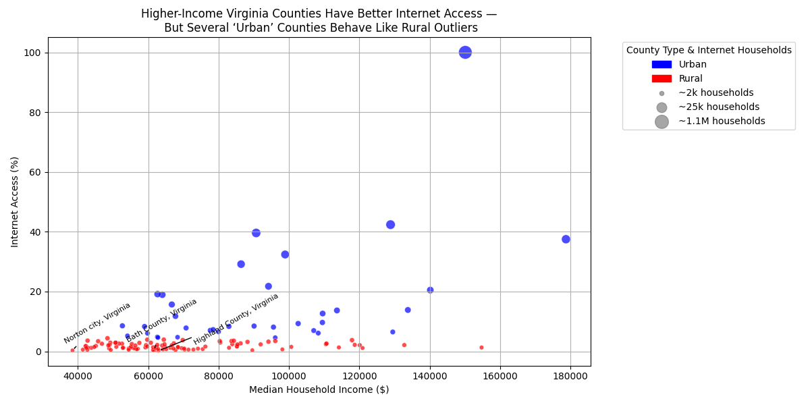
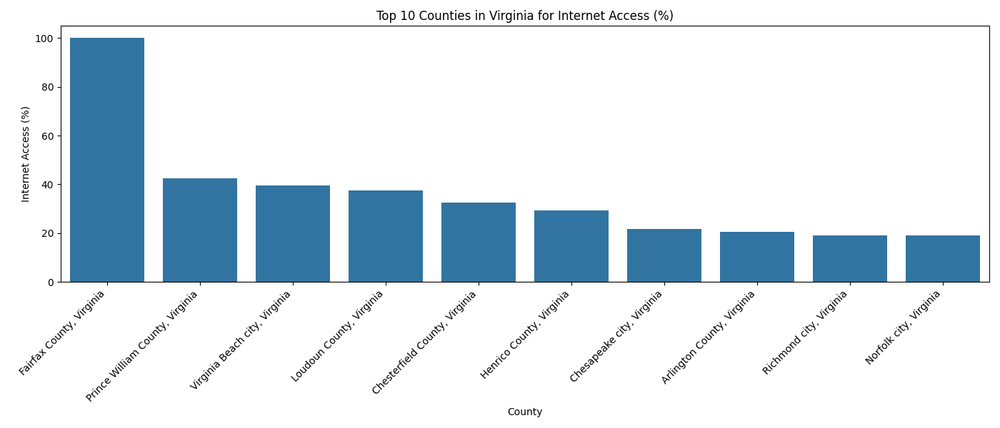
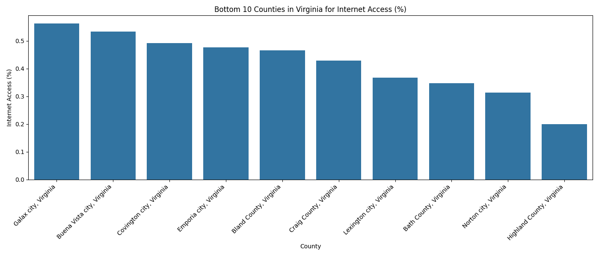

# Semester Project: Exploring Inequities in Internet Access Across Virginia Communities

Amelia Ragsdale  
CS 625, Fall 2025  
Due: December 7, 2025

---

## GitHub Repository and Code

- **Project Repository:** [Insert your GitHub repo URL here]  
- **Python Implementation of Final Chart:** [Insert link to Python file or notebook for scatterplot and bar charts here]  

This repository contains all data cleaning, processing, and visualization code used to generate the final charts. The code is fully reproducible, and all charts can be recreated by running the Python scripts with the provided CSV files.

---

## Data

For this project, I analyzed the data on internet access and household income across Virginia counties. The datasets were obtained from the **U.S. Census Bureau’s American Community Survey (ACS) 5-Year Estimates**:  

- **Internet Subscriptions in Households:** Number of households in each Virginia county with internet subscriptions.  
  [Internet_Subscriptions.csv](internet_subscription.csv)
- **Median Household Income:** Median income per county.  
  [Median_Income](median_income.csv)

I cleaned the datasets by selecting only the necessary columns and names, converting string values to numeric, and removing missing or invalid entries. After cleaning, I merged the two datasets on the county name to align all variables correctly. To facilitate comparison across counties of different sizes, I calculated a derived variable, `Internet_Access_Pct`, representing the percentage of households with internet access relative to the county with the highest number of households. This metric allows fair comparison and makes the scatterplot more understanding to the viewer.

---

## Scatterplot: Higher-Income Virginia Counties Have Better Internet Access But Several "Urban" Counties Behave Like Rural Outliers

**Idiom:** Scatterplot  
**Marks:** Points (circles)  
**Data:** Median Household Income (quantitative), Internet Access (%) (quantitative), County Type (categorical/color), Number of Households (quantitative/size)  
**Encode:** x-axis = Median Household Income, y-axis Internet Access (%), color = County Type (Urban vs. Rural), size = Number of Households with Internet  

The scatterplot shows the relationship between median household income and internet access across Virginia counties. Higher-income counties tend to have the higher internet access percentages, but several counties classified as urban behave more like rural counties, with lower-than-expected access. These outliers are annotated with arrows to highlight misclassifications or infrastructure limitations.  

The use of point size to represent the number of households provides additional context about the scale of each county, while color distinguishes between urban and rural counties. The chart title, “Higher-Income Virginia Counties Have Better Internet Access — But Several ‘Urban’ Counties Behave Like Rural Outliers,” succinctly summarizes the main insight. The scatterplot effectively communicates both the general trend and the exceptions, making it easier to understand how inequities continue within the state.

**Figure: Higher-Income Virginia Counties Have Better Internet Access But Several "Urban" Counties Behave Like Rural Outliers**  

---

## Top 10 Counties in Virginia for Internet Access Bar Chart

**Idiom:** Bar Chart  
**Marks:** Rectangles (bars)  
**Data:** County (categorical), Internet Access (%) (quantitative)  
**Encode:** x-axis = County, y-axis = Internet Access (%)  

The top 10 counties bar chart emphasizes which counties lead in internet access. Most of these counties are urban and higher-income, demonstrating that broadband connectivity is concentrated in wealthier or densely populated areas. Differences in bar height allow easy comparison across counties, while labels clearly identify each location. This visualization provides concrete examples of how income and urban status contribute to higher internet access, complementing the scatterplot by highlighting the upper end of the distribution.

**Figure: Top 10 Counties for Internet Access (%)**  

---

## Bottom 10 Counties in Virginia for Internet Access Bar Chart

**Idiom:** Bar Chart  
**Marks:** Rectangles (bars)  
**Data:** County (categorical), Internet Access (%) (quantitative)  
**Encode:** x-axis = County, y-axis = Internet Access (%)  

The bottom 10 counties bar chart highlights the counties with the lowest internet access. These are mostly rural and lower-income counties, emphasizing the digital divide. Bar height differences clearly communicate the severity of the gap. This chart is especially useful for identifying areas where policy intervention or infrastructure investment may be necessary. Together with the top 10 chart and scatterplot, it provides a overall comprehensive view of internet access disparities across Virginia.

**Figure: Bottom 10 Counties for Internet Access (%)**  

---

## Development and Recreation of Charts

I recreated these visualizations in Python using Pandas, Seaborn, Matplotlib, and the `adjustText` library. This allowed precise control over axis labels, point sizes, colors, and annotations. The `adjustText` library prevented overlapping labels in the scatterplot, and the legend was customized to show approximate household counts without including column names for overcrowding. 

Creating the charts required careful data cleaning, especially converting raw ACS data to a usable format and computing the derived percentage metric. Identifying outlier counties and adjusting labels took significant effort but improved readability and highlighted interesting findings. Python provided easability and flexibility that allowed me to create clean, high-quality static charts suitable for analysis and presentation.

---

## Final Thoughts 

This project highlighted disparities in internet access across Virginia counties. While income strongly correlates with connectivity, several counties classified as urban exhibit low access, suggesting that infrastructure gaps and other local factors affect connectivity beyond income. Additionally, these disparities often align with educational gaps, as lower-income and rural counties typically have fewer educational resources and lower broadband penetration. Limited internet access in such areas can exacerbate existing educational inequalities, hindering students’ ability to participate in online learning, access digital resources, and complete homework effectively.

Creating the charts in Python strengthened my skills in data cleaning, merging datasets, calculating derived metrics, and building explanatory visualizations. Annotating the scatterplot and scaling points for population were the most time-consuming parts, but they significantly improved clarity and interpretability of the data. The bar charts for the top and bottom 10 counties provided concrete examples of disparities at both ends of the spectrum, while the scatterplot gave context to these differences and revealed notable outliers. Overall, the final charts effectively show both trends and exceptions in internet access, making the analysis accessible to viewers. They also emphasize that addressing digital inequity requires attention not only to income but also to educational and infrastructural factors, highlighting areas where targeted interventions could have the greatest impact.

---

## References

- U.S. Census Bureau, *American Community Survey (ACS) 5-Year Estimates: Internet Subscriptions in Households*, <https://data.census.gov/table/ACSDT5Y2023.B28011?q=internet+access&g=040XX00US51$0500000>
- U.S. Census Bureau, *American Community Survey (ACS) 5-Year Estimates: Median Household Income*, <https://data.census.gov/table/ACSDT5Y2023.B19013?q=household+income&t=Income+and+Poverty&g=040XX00US51$0500000>
- Python libraries: Pandas, Seaborn, Matplotlib, adjustText
